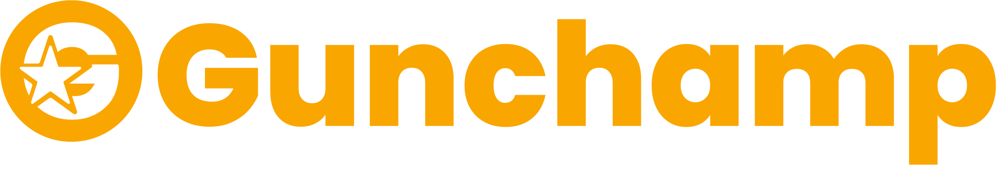

<p align="center"><a href="#" target="_blank"></a></p>

## About Gunchamp

gunchamp is a web application to share information about competitions at Gunadarma University. users can login and create competition information to be distributed on this web.

## How to run thi project

### Membuat file `.env`

```bash
$ cp .env.example .env
```

### install package dan dependency

```bash
$ composer install
```

### generate key untuk dimasukkan ke `APP_KEY` di file `.env`

```bash
$ php artisan key:generate
```

### jika aplikasi Laravel tersebut memiliki database, buatlah nama database baru. Lalu sesuaikan nama database, username, dan password database di file `.env`. lalu ketiikan perintah berikut:

```bash
$ php artisan migrate
```

```bash
$ php artisan db:seed
```

### untuk membuka pada web browser, gunakan perintah berikut

```bash
$ php artisan serve
```

## License

The Laravel framework is open-sourced software licensed under the [MIT license](https://opensource.org/licenses/MIT).
